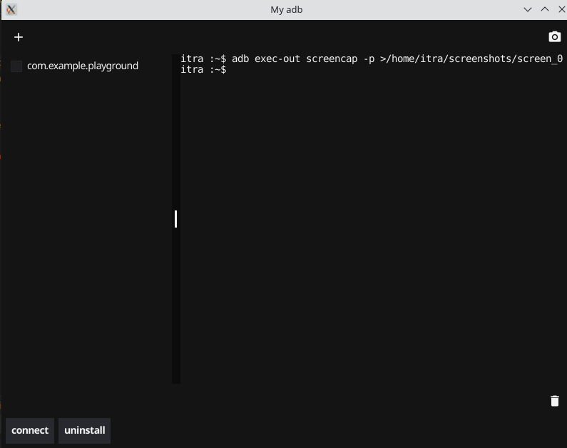

## ADB GUI Tool

ADB GUI Tool is a graphical user interface application for managing Android devices using ADB (Android Debug Bridge). It provides a convenient and intuitive interface to perform various ADB operations, such as uninstall APKs, running shell commands, capturing screenshots, and more.


<div align="center">
     
</div>


### Features

- uninstall APKs on connected devices.
- Run shell commands on devices.
- Capture screenshots from devices.
- Easy-to-use and intuitive user interface.

### Prerequisites

- Go programming language (version 1.19or higher)
- ADB (Android Debug Bridge) installed on your system

### Installation

1. Clone the repository:

  ```shell
  git clone https://github.com/serhiq/go_fyne_my_adb.git
  ```

2. Change to the project directory:

  ```shell
  cd my-adb-app/cmd
  ```

3. Build the application:

  ```shell
  go build -o adb-gui-tool
  ```

4. Run the application:

  ```shell
  ./adb-gui-tool
  ```


### Usage

1. Launch the ADB GUI Tool application.
2. Connect your Android device(s) to the computer using USB.
3. Use the provided interface to install APKs, run shell commands, capture screenshots, and manage the connected device.
4. Disconnect the device or close the application when finished.

### Contributing

Contributions are welcome! If you find any issues or have suggestions for improvements, please feel free to open an issue or submit a pull request on the GitHub repository.

### License

ADB GUI Tool is licensed under the [MIT License](LICENSE).